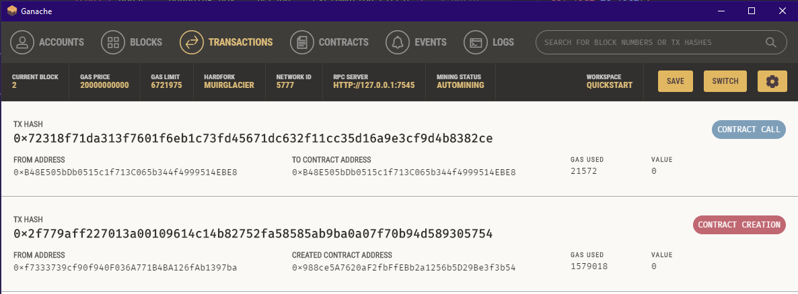
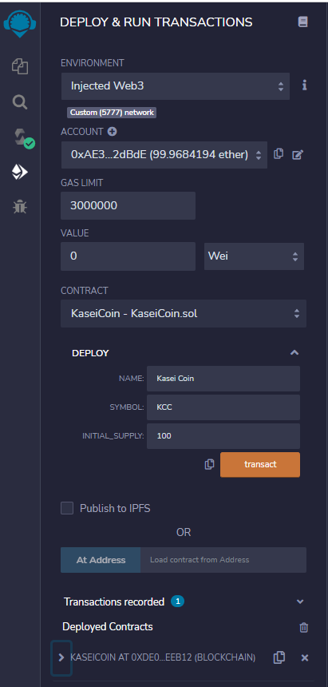
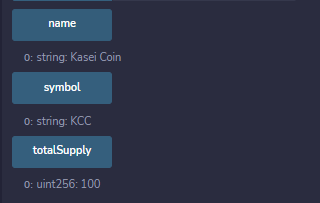

<h1 align="center">Martin Token Crowdsale</h1>
<h3 align="center">Solidity & Ganache</h3>

  
    <section></section>
    <section> <b> By: Ebad Salehi </b> </section>

  

———————— ≡≡≡≡≡≡ ————————
 
<!-- TABLE OF CONTENTS -->

  
 <b>Table of Contents</b>

  <ul>
        <li><a href="#Glance"> At A Glance</a> </li>
        <li><a href="#Screenshots"> Screenshots</a></li>
        <li><a href="#Code">Source Code</a></li>
        <li><a href="#Tech">Technologies Used</a></li>
        <li><a href="#Author">Author</a></li>
  </ul>

———————— ≡≡≡≡≡≡ ————————

 

## At A Glance

After waiting for years and passing several tests, the Martian Aerospace Agency selected you to become part of the first human colony on Mars. As a prominent fintech professional, they chose you to lead a project developing a monetary system for the new Mars colony. You decided to base this new system on blockchain technology and to define a new cryptocurrency named **KaseiCoin**. (Kasei means Mars in Japanese.)

KaseiCoin will be a fungible token that’s ERC-20 compliant. You’ll launch a crowdsale that will allow people who are moving to Mars to convert their earthling money to KaseiCoin.
 

## Screenshot

(<a href="#top">Back to top</a>)

    
 

## Source Code

[KaseiCoin.sol](Code/KaseiCoin.sol)
 

[KaseiCoinCrowdsale.sol](Code/KaseiCoinCrowdsale.sol)
 

## Technologies Used

* Ganache
* Solidity
* Injected Web3
* OpenZepplin (imported)
* VS Code
* Remix - Ethereum IDE

 

## Author
Ebad Salehi

(<a href="#top">Back to top</a>)

    
 
